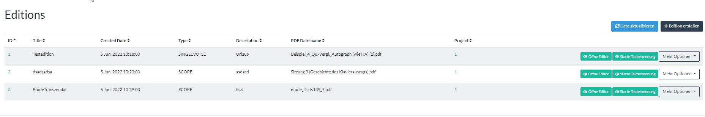
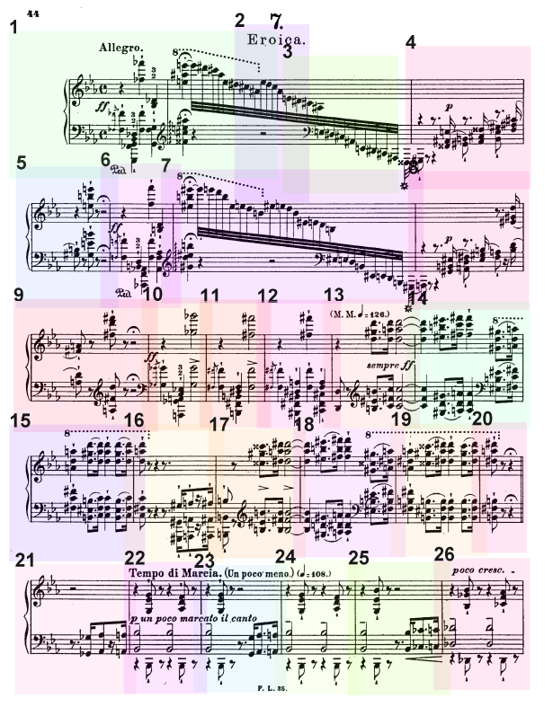

# Measure Detector UI

This is the repository for a GUI for the Measure Detector developed in a cooperation of LMU and TU in Munich. Based on a clean 4-Tier architecture it provides a way, to simplify the process of "Measure Counting" (Vertaktung) done in modern music edition projects. Until now, most of this process was done non-digital in a manual way. Using the power of AI, this process can be speed-up.

This application was generated using JHipster 7.4.0, you can find documentation and help at [https://www.jhipster.tech/documentation-archive/v7.4.0](https://www.jhipster.tech/documentation-archive/v7.4.0).


# Core Functions

* Manage Projects and Editions with sheets of music

  
* Automatic Measure Detection with the Measure Detector: https://github.com/OMR-Research/MeasureDetector
* Provides a web-based front-end (AngularJS) where edition works can be managed.
* Export into MEI / PDF with Annotations

  
* User Management, Scheduling System, ...

# Getting-Started

This section guides you throw the installation of the application and its required dependencies.

## Repo Structure

* doc/**: Contains all the required documentation generate with mkdocs which enables simple web rendering of the whole documentation contents

* app/**: Contains the whole application

## Setting-up this repository

  
1) Clone the repository: 

       git clone https://github.com/lukas681/Measure-Detector-UI.git 

3) Make sure to have **Docker** installed. Use WSL 2 + Docker on WNX based systems. Then build the Measure Detector Docker container. Use the provided Makefile.

        $ cd docker/measure-detector-docker
        $ make build-docker


   Otherwise, just build the container manually:

        $ cd measure-detector-docker
        # Build the image with the latest model
        $ docker build --no-cache --tag mdet:1 -t measure_detector .

        # Run in container (change port to `XXXX:8080` if needed):
        $ docker run --name mdet -d -p ${PORT}:8080 measure_detector
   
3) (Optional) Test the REST interface:

        curl --location --request POST 'localhost:8080/upload' --form 'image=@"path/to/example/image"'

# Further Configurations

You need to follow these steps, to set-up the application correctly:

* As the upload mechanism is not implemented optimally, yet, weshoudl increase the maximal receiving file length. (Affects the maximal size of a music document to be uploaded).

You can therefore free around 1/3 of your available (e.g. 5GB on a 16GB machine). To do so, open `app/src/main/resources/config/application-xx.yml` (dev, prod, xx) and modify the following line:


      spring:
         codec:
            max-in-memory-size: 5GB

# Quick Start of the Jhipster Application

You can run the application inside a docker containre with the official jhipster docker images. therefore execute the following commands. Make sure to provide absolute paths as relative paths are not supported any more by docker.


      cd measure-detector-ui/app
      docker run --network="host" -v ${PWD}:/home/jhipster/app -p 8000:8000 --rm jhipster/jhipster .\gradlew bootRun --args='--spring.profiles.active=dev'

Voilâ, the application should already start ...

> Note: --network="host" will embedd the host localhost inside the container, so that we can also reach the Measure Detector in the other container. Concerning security, this is not optimal and should be switched to a Virtual Network based approach (Docker Networking + Docker Compose)


# Starting Development Mode

in order to strat the application, call the gradle wrapper with the corresponding profile. It might be necessary, to also installed the openseadragon 2.4.8 type delarations manually to match those required by AnnotoriusJS.

       cd app
      ./gradlew bootRun --args='--spring.profiles.active=dev'

       # wait for finish
       npm i --save-dev @types/openseadragon@2.4.8
       npm start

       --------------------------------------
       Local: http://localhost:8080
       External: http://192.168.2.148:8080
       --------------------------------------
       UI: http://localhost:3001
       UI External: http://localhost:3001
        --------------------------------------

# Running in Productive Mode

Note: In most cases it is easier to use the development mode (uses a h2 file database). In case you want to deploy the application on a large scale level, consider using this prod profile.
Currently, the productive mode is configured to use a local mysql instance. Observe the corresponding line in the application.yml:

      liquibase:
         contexts: prod
         url: jdbc:mysql://localhost:3306/MeasureDetector?useUnicode=true&characterEncoding=utf8&useSSL=false&useLegacyDatetimeCode=false&serverTimezone=UTC&createDatabaseIfNotExist=true

In order to run against a local h2 database (Should also be sufficient as we do not store large data in the database so far...), just run in development mode.

# Overview: Interfaces

You have access to the following interfaces acompanying the application (Standard Ports):

* **Swagger**: Login -> Administration/Api
* **JobRunR** (Tracks the background jobs) -> :8000
* **Main Application** -> 8080
* **Measure Detector** Listener: 8081

# Software Stack & Versions

The following frameworks are used for building this application. In general, **jhipster 7.4.0** was used to generate the backbone of the application

| Name  	      | Version 	 |   Required	|
|--------------|-----------|---	|
| NodeJS 	     | 14 	      |  yes 	|
| Docker 	     | 	         |  yes 	|
| Java         | 	14       |  yes 	|
| TensorFlow 	 | 1.13.1 	  |   via gradle	|


## Building for Production

### Packaging as jar

To build the final jar and optimize the MeasureDetector application for production, run:

```
./gradlew -Pprod clean bootJar
```

This will concatenate and minify the client CSS and JavaScript files. It will also modify `index.html` so it references these new files.
To ensure everything worked, run:

## Testing

To launch your application's tests, run:

```
./gradlew test integrationTest jacocoTestReport
```


# Experimental: Setting it up in a Docker Container without any Build Script

This function can be used to really debug all the necessary steps.

     $ docker run ubuntu /bin/bash

     apt update
     apt install gradle 
     cd ~
     git clone https://gitlab.lrz.de/ge82xib/measure-detector-ui # dding TUM Credentials
     cd measure-detector-ui/app     
     chmod +x gradlew 
     ./gradlew

## License

Distributed under the MIT License. See `LICENSE.md` for more information.

## Contact

Lukas Retschmeier - [lukasretschmeier.de](https://lukasretscheier.de) - lukas.retschmeier@tum.de

Project Link: [https://github.com/lukas681/Measure-Detector-UI](https://github.com/lukas681/Measure-Detector-UI)

<p align="right">(<a href="#readme-top">back to top</a>)</p>

## Acknowledgments

The Measure Detector DNN model was trained in this project [https://github.com/OMR-Research/MeasureDetector/](project)
   
# Further links

[node.js]: https://nodejs.org/
[npm]: https://www.npmjs.com/
[webpack]: https://webpack.github.io/
[browsersync]: https://www.browsersync.io/
[jest]: https://facebook.github.io/jest/
[leaflet]: https://leafletjs.com/
[definitelytyped]: https://definitelytyped.org/
[angular cli]: https://cli.angular.io/