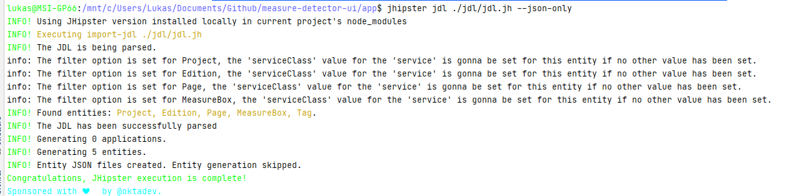

# Architectural Overview

## JHipster

## Data Model

The datamodel can be generated for the corresponding JDL file which is located in the /jdl folder on the top level. 

Further information can be found at the official documentation: [JDL Documentation](http://easynode.github.io/jdl/)

in order to generate new entities just modify the jdl file and call

    $ jhipster jdl ./jdl/jdl.jh

The output should be something like this:

## API and Interfaces

### openAPI

OpenAPI is used for creating all the necessary endpoints and the shared models between the back-and frontend.

* The specification file is located under ./api

#### Generate Backend Endpoints.

Just trigger the `openAPIGenerate` task from gradle. This will generate a the folder `build/openapi/src/main/java`  and also automatically embedd it into the Spring Boot application.

#### Generate Front-End (Angular) Models

In order to use a shared model, these can be generated with openapi-generator-cli, specified in the package.json for the webapplication

    "scripts": {
        "generate:api": "openapi-generator-cli generate -g typescript-angular -i ./api/api.yml -o ./src/main/webapp/app/shared/model/openapi",
        "app:start": "./gradlew",